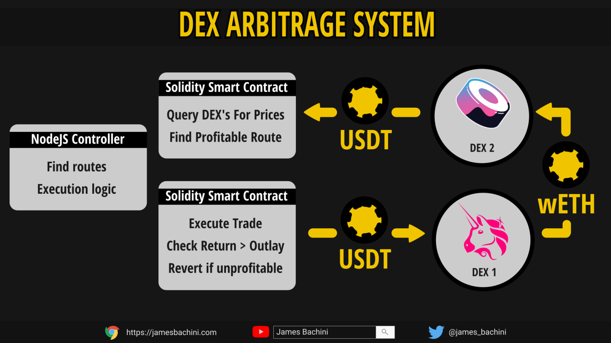

<h1 align="center">PolyBot</h1>
<p align="center">Cryptocurrency arbitrage trading bot
</p>
<p align="center">
  
</p>


### Bot
The simplify cryptocurrency arbitrage trading bot (alpha) version based on Uniswap V2 protocol in the Polygon network.

### Traiding flow
<p align="center">
  
</p>


### Instruction

```
git clone https://github.com/GemsGame/polybot
cd polybot
npm install
rename .env.file to .env and add PRIVATE_KEY
npx hardhat run --network polygon scripts/deploy.ts
add CONTRACT_ADDRESS to .env
add crypto to the smart contract
npm run trade
```


### Disclaimer
Note the code is provided for educational purposes, is unaudited and not fit for financial transactions.

### Inspired with:
https://github.com/jamesbachini/DEX-Arbitrage/

### Research & Results

This is an experimental non-profitable system like James Bachini's. Unfortunately, simple things can't be profitable at all. You must do your own research and develop a strategy.
